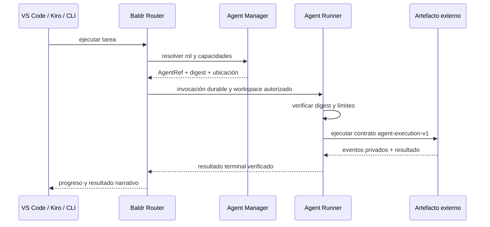

:::note[Fuente canónica · v0.20.0]
Esta página se genera desde [`agentes-externos-necesitan-fronteras.md`](https://github.com/BaldrVivaldelli/baldr-router/blob/v0.20.0/docs/agentes-externos-necesitan-fronteras.md). No la edites en este repositorio.
Digest de la fuente: `a66cd2bc2724a928bd6410a9dd404e574e31a594de8b0ce08ac0d25fd0257927`.
:::
Los modelos de lenguaje permiten crear agentes con mucha rapidez. El problema
difícil aparece después: identificarlos, construirlos de forma reproducible,
darles solamente los permisos necesarios, coordinarlos desde distintas
superficies y poder actualizar o revertir una versión sin perder trazabilidad.
La evolución de Baldr muestra por qué un orquestador no debería apropiarse del
código de los agentes, sino ofrecer contratos estables para descubrirlos,
resolverlos y ejecutarlos.

**18 de julio de 2026**

---

**Autor:** Equipo Baldr

Este artículo cuenta las decisiones de diseño detrás de la plataforma de
agentes externos de Baldr. No reemplaza la especificación de
[External Agent Runtime](../external-agent-runtime/) ni la de
[Builder Protocol](../builder-protocol/); explica por qué esas fronteras existen
y qué aprendimos al construir un vertical real en Python y TypeScript.

## Contenido

- [El problema empieza después de la primera demostración](#el-problema-empieza-después-de-la-primera-demostración)
- [Por qué no poner los agentes dentro de Baldr](#por-qué-no-poner-los-agentes-dentro-de-baldr)
- [La arquitectura se descubrió construyendo un caso real](#la-arquitectura-se-descubrió-construyendo-un-caso-real)
- [Un modelo semántico para hablar de agentes](#un-modelo-semántico-para-hablar-de-agentes)
- [Builder Protocol como frontera políglota](#builder-protocol-como-frontera-políglota)
- [Ejemplo: un agente TypeScript de punta a punta](#ejemplo-un-agente-typescript-de-punta-a-punta)
- [Coordinar no es lo mismo que ejecutar](#coordinar-no-es-lo-mismo-que-ejecutar)
- [Identidad inmutable en lugar de nombres ambiguos](#identidad-inmutable-en-lugar-de-nombres-ambiguos)
- [Los permisos son parte del tipo del agente](#los-permisos-son-parte-del-tipo-del-agente)
- [Dos etapas distintas de trabajo](#dos-etapas-distintas-de-trabajo)
- [Qué debe ser Baldr y qué conviene dejar afuera](#qué-debe-ser-baldr-y-qué-conviene-dejar-afuera)
- [Costos y límites de esta arquitectura](#costos-y-límites-de-esta-arquitectura)
- [El siguiente paso](#el-siguiente-paso)
- [Conclusión](#conclusión)

---

Los agentes suelen comenzar como una función que recibe una instrucción, llama
a un modelo y devuelve una respuesta. Esa forma es suficiente para explorar
una idea. También oculta casi todas las decisiones que aparecen cuando el
agente empieza a trabajar sobre repositorios reales.

¿Qué versión se ejecutó? ¿Quién publicó esa versión? ¿Puede leer o también
escribir? ¿El artefacto que corre es el mismo que fue revisado? ¿Qué pasa si el
proceso se interrumpe después de modificar un archivo? ¿Cómo usa el mismo
agente una extensión de VS Code, Kiro o una CLI? ¿Cómo se vuelve a la versión
anterior?

Estas preguntas no se resuelven agregando instrucciones al prompt. Requieren
identidad, contratos, límites de efectos, persistencia y un ciclo de release.

## El problema empieza después de la primera demostración

Un prototipo puede apuntar directamente a un archivo Python, un script
TypeScript o una configuración local. La ubicación funciona como identidad y
el entorno del desarrollador completa implícitamente todo lo que falta. El
agente encuentra dependencias porque el checkout está presente, hereda las
credenciales de la terminal y escribe porque el proceso tiene acceso al mismo
workspace que la persona.

Esa comodidad se transforma en ambigüedad cuando el agente se comparte:

- una ruta local no representa una versión;
- el mismo nombre puede resolver contenidos diferentes;
- un build puede depender accidentalmente de `node_modules`, un entorno
  virtual o archivos del monorepo;
- el permiso efectivo depende del proceso que inició al agente;
- una actualización puede reemplazar silenciosamente el comportamiento que
  estaba en uso;
- una interfaz puede mostrar un agente disponible aunque su artefacto ya no
  exista.

La tentación inicial es incorporar todo al orquestador: copiar los agentes al
repositorio principal, sumar sus prompts a la configuración central y darles
acceso a las mismas herramientas. Esto reduce la fricción durante unos días,
pero hace que cada agente nuevo amplíe el núcleo, el ciclo de release y la
superficie de confianza del producto completo.

> **Idea central:** crear un agente puede ser fácil; operarlo como una unidad
> identificable, reemplazable y limitada es un problema de plataforma.

## Por qué no poner los agentes dentro de Baldr

Baldr coordina trabajo. Los equipos que crean agentes son dueños de su código,
sus pruebas, su lenguaje y su calendario de publicación. Mezclar esas dos
responsabilidades produciría un monolito organizacional antes que uno
puramente técnico.

Si los agentes vivieran dentro de Baldr, el Router tendría que conocer:

- la estructura de cada proyecto;
- las dependencias y herramientas de cada lenguaje;
- los prompts y reglas privadas de cada equipo;
- la forma de construir y probar cada artefacto;
- el ritmo de actualización de todos los agentes;
- secretos o recursos específicos de productos que Baldr no debería poseer.

La alternativa es que Baldr conozca únicamente aquello que necesita para
coordinar: una identidad exacta, capacidades declaradas, modo de efectos,
ubicación estable, digest del manifiesto y un protocolo de ejecución.

```text
equipo propietario                     infraestructura Baldr

código + pruebas
      |
      v
SDK del lenguaje
      |
      v
Agent Builder + driver  ------->  artefacto + manifiestos
                                         |
                                         v
                                   Agent Manager
                                         |
                                  AgentRef + digest
                                         |
                                         v
                                Router -> Runner
                                         |
                                         v
                               workspace autorizado
```

Esta separación permite que un agente se desarrolle en otro repositorio sin
convertirse en un plugin cargado dentro del proceso del Router. Baldr conserva
el control de coordinación y política; el equipo conserva la propiedad del
comportamiento.

## La arquitectura se descubrió construyendo un caso real

La separación anterior parece simple cuando se dibuja terminada. No surgió de
definir todas las interfaces por adelantado. Apareció al intentar ejecutar el
mismo agente desde un repositorio externo y en dos lenguajes.

El primer corte funcional reveló varias responsabilidades que al principio
estaban mezcladas:

1. El SDK debía ofrecer la API que importa el agente, sin incorporar la
   toolchain de publicación.
2. Agent Builder debía conocer el proyecto y su ciclo de release, pero no
   implementar internamente todos los lenguajes.
3. Cada driver debía transformar fuentes en un artefacto reproducible mediante
   un contrato común.
4. Agent Manager debía almacenar y resolver identidades, no ejecutar código.
5. Runner debía ejecutar el artefacto fuera del proceso del Router y aplicar
   límites de datos y efectos.
6. Router debía coordinar fases durables y seleccionar participantes exactos.

El agente piloto TypeScript fue especialmente útil. Mientras el driver solo se
ejecutaba desde el monorepo, parecía independiente. Al instalarlo globalmente
desde un tarball apareció una dependencia oculta: el digest del driver incluía
rutas absolutas y cambiaba según el directorio de instalación. La solución no
fue documentar una ruta recomendada, sino redefinir la identidad sobre nombres
lógicos y contenido.

Ese defecto era pequeño, pero mostró una regla general: una frontera no es real
hasta que funciona sin el checkout que la originó.

## Un modelo semántico para hablar de agentes

Antes de la plataforma externa, palabras como “agente”, “modelo”, “rol” y
“provider” podían superponerse. Para coordinar agentes publicados se necesitó
un vocabulario más preciso.

El modelo de Baldr distingue:

- **rol:** responsabilidad dentro de una fase, como planificación, ejecución o
  revisión;
- **AgentRef:** identidad versionada del participante;
- **digest del manifiesto:** identidad del contenido declarado;
- **artefacto:** programa autocontenido que ejecutará el Runner;
- **capacidad:** acción que el agente afirma poder realizar;
- **modo de efectos:** frontera operacional, por ejemplo `read-only` o
  `workspace-write`;
- **driver:** implementación de build para un lenguaje;
- **release:** combinación inmutable de definición, artefacto y manifiestos;
- **resolución de equipo:** decisión durable que asigna identidades exactas a
  los roles de un workflow.

Una referencia típica tiene esta forma:

```text
local://personal/repository-report-typescript-writer@1.0.0
```

El nombre ayuda a una persona, pero no alcanza para ejecutar. La resolución
también fija el digest del manifiesto. El workflow conserva ambas piezas y no
vuelve a interpretar “la última versión” a mitad de una sesión.

```text
AgentRef exacto + digest exacto + capacidades + efectos
                         |
                         v
               participante durable
```

Este modelo semántico reduce la cantidad de decisiones abiertas para las
fachadas. VS Code y Kiro no necesitan entender cómo se construyó un agente
TypeScript. Solo necesitan presentar opciones compatibles y enviar a Baldr la
identidad seleccionada.

## Builder Protocol como frontera políglota

Un SDK políglota no resuelve por sí mismo un build políglota. Python puede
producir un `.pyz`; TypeScript puede producir un `.cjs`; Rust podría producir
un binario. Sus toolchains, inventarios y diagnósticos son diferentes.

Implementar todas esas decisiones dentro de Agent Builder volvería a crear el
acoplamiento que queríamos evitar. Builder Protocol introduce una frontera
neutral entre el ciclo de desarrollo y la herramienta específica del
lenguaje.

```text
baldr-agent test/build/publish
              |
              v
       Builder Protocol v1
              |
       selección por identidad
              |
              +----> driver Python
              +----> driver TypeScript
              +----> futuro driver Rust
```

El driver anuncia una identidad que incluye id, versión y digest. Agent Builder
lo descubre desde una registración explícita o mediante un ejecutable acotado
en `PATH`. Después intercambia solicitudes y respuestas JSONL versionadas.

El protocolo no intenta uniformar los compiladores. Uniforma aquello que
Builder necesita comprobar:

- qué operación se solicitó;
- sobre qué inventario de fuentes;
- qué versión de driver la realizó;
- qué artefacto produjo;
- cuál es su digest;
- qué metadata debe acompañar al release;
- si una repetición representa el mismo trabajo.

El JSON es un formato de transporte, no el modelo completo. La semántica está
en el contrato versionado, las validaciones y las invariantes que rodean al
mensaje.

## Ejemplo: un agente TypeScript de punta a punta

El flujo comienza en el repositorio del equipo, no en Baldr:

```bash
baldr-agent init ./repository-report \
  --name repository-report \
  --owner personal \
  --namespace personal \
  --language typescript

cd repository-report
baldr-agent test
baldr-agent build
baldr-agent publish
baldr-agent doctor
```

El proyecto declara su lenguaje, entrypoint, driver y roles en
`baldr-agent.toml`:

```toml
schema_version = 2
name = "repository-report-typescript"
owner = "personal"
namespace = "personal"
version = "1.0.0"
language = "typescript"
entrypoint = "src/agent.ts"
driver = "baldr.typescript"

[[roles]]
name = "writer"
capabilities = ["workspace.read", "workspace.write", "role.implementer"]
effect_mode = "workspace-write"
```

El código importa solamente el SDK de autoría. El fragmento siguiente abrevia
el `final_report`; un agente real completa los campos narrativos y de evidencia
definidos por el contrato del rol:

```ts
import { Agent } from "@baldr/agent-sdk";

const agent = new Agent({
  ref: process.env.BALDR_AGENT_REF!,
  owner: "personal",
  capabilities: ["workspace.read", "workspace.write", "role.implementer"],
});

agent.invoke(async (request, context) => {
  context.emit("analyzing", "Revisando el repositorio");
  // El comportamiento pertenece al repositorio del agente.
  return {
    ok: true,
    final_report: {
      status: "implemented",
      summary: "El reporte fue generado",
    },
  };
});

process.exitCode = await agent.serveStdio();
```

Durante `build`, el driver TypeScript genera un `.cjs` autocontenido. Dos
builds con las mismas fuentes deben producir los mismos bytes. Durante
`publish`, Agent Builder instala el artefacto en una ubicación estable, genera
los manifiestos de planner, writer y reviewer, y publica esas identidades en el
catálogo local o en Agent Manager.

El código del agente nunca se copia al Router. Lo que cruza la frontera es un
release identificable.

## Coordinar no es lo mismo que ejecutar

Separar Router y Runner evita que el control plane se convierta en el lugar
donde corre código de terceros.

Router decide:

- qué workflow está activo;
- qué rol debe ejecutarse;
- qué identidad exacta ocupa ese rol;
- qué capacidades permite la fase;
- qué hacer ante reintentos, cancelaciones o resultados inciertos;
- qué progreso durable puede mostrarse a la persona.

Runner decide:

- cómo verificar el artefacto inmediatamente antes de ejecutarlo;
- qué directorio recibe el proceso;
- qué entorno mínimo puede heredar;
- cómo limitar tiempo y tamaño de entrada/salida;
- cómo persistir estado y eventos privados;
- cómo terminar el grupo de procesos;
- cuándo una interrupción de escritura debe marcarse como `unknown`.



Esta separación también deja abierta la evolución del data plane. Un futuro
Runner podría usar contenedores o jobs remotos sin cambiar la forma en que el
workflow fija identidades y resultados.

## Identidad inmutable en lugar de nombres ambiguos

Una versión publicada no puede aceptar contenido diferente. Si el código, los
roles, las capacidades o los manifiestos cambian, la versión debe cambiar.

La inmutabilidad aporta tres propiedades:

1. **Repetición segura.** Publicar otra vez exactamente el mismo release es
   idempotente.
2. **Auditoría.** Una sesión durable puede demostrar qué manifiesto y artefacto
   utilizó.
3. **Rollback.** Volver a `1.0.0` significa reactivar una identidad conocida,
   no reconstruir aproximadamente un estado anterior.

```text
1.0.0 + digest A  -> válido
1.0.0 + digest A  -> repetición idempotente
1.0.0 + digest B  -> rechazado; requiere nueva versión
1.1.0 + digest B  -> válido
```

El digest no reemplaza a la versión. La versión comunica intención y evolución
a las personas; el digest prueba contenido a las máquinas. Baldr necesita
ambos.

## Los permisos son parte del tipo del agente

Un agente no debería recibir permisos solamente porque la aplicación que lo
invocó puede escribir. El manifiesto declara capacidades y la fase declara qué
efectos acepta. El permiso efectivo es la intersección de ambas cosas.

Para planificación y revisión, Runner crea una copia descartable y reducida:
sin metadata Git, dependencias generadas, symlinks ni entradas especiales. El
agente puede observar, pero no recibe la ruta original.

Para implementación, Baldr entrega el workspace exacto únicamente cuando:

- el rol requiere escritura;
- el manifiesto declara `workspace.write`;
- el modo de efectos es `workspace-write`;
- el workspace ya fue confiado por la superficie;
- la política conserva un único escritor para esa fase.

Esto evita dos extremos igualmente problemáticos: bloquear siempre la
escritura aunque ya esté autorizada, o confiar en cualquier agente porque fue
seleccionado desde una interfaz local.

También cambia la semántica de los fallos. Interrumpir una lectura permite un
reintento normal. Interrumpir una escritura puede dejar efectos parciales; por
eso el resultado pasa a `unknown` y requiere reconciliación durable.

## Dos etapas distintas de trabajo

La plataforma expone dos ciclos que conviene no mezclar.

### Diseñar y publicar el agente

En esta etapa el equipo explora el comportamiento, cambia el código, mejora
pruebas y descubre qué capacidades necesita. El SDK aporta vocabulario; Agent
Builder y el driver aportan validación y reproducibilidad.

El proceso es deliberadamente iterativo:

```text
idea -> implementación -> test -> build -> inspección -> nueva versión
```

Baldr no debería intentar decidir la arquitectura interna del agente. Ese
diseño pertenece al equipo que lo mantiene.

### Resolver y operar el agente

Una vez publicado, la relación cambia. El workflow no recibe “el agente más
nuevo” como una sugerencia abierta: recibe una identidad compatible, verifica
su estado y la fija para la sesión.

```text
descubrimiento -> resolución -> ejecución -> evidencia -> actualización/rollback
```

Aquí la creatividad importa menos que la previsibilidad. Las decisiones deben
ser determinísticas, explicables y recuperables después de un reinicio.

Separar estas etapas permite que el desarrollo sea flexible sin convertir la
operación en algo ambiguo.

## Qué debe ser Baldr y qué conviene dejar afuera

Baldr debería ser responsable de:

- contratos e identidades;
- descubrimiento y resolución de equipos;
- políticas de capacidades y efectos;
- workflows durables;
- ejecución aislada mediante Runner;
- evidencia, diagnóstico y recuperación;
- superficies consistentes para VS Code, Kiro, CLI y MCP.

Baldr no debería ser responsable de:

- almacenar el código fuente de todos los agentes;
- imponer un lenguaje de programación;
- centralizar los prompts privados de cada producto;
- reconstruir internamente todas las toolchains;
- entregar automáticamente todos los secretos del usuario;
- reemplazar el sistema de versionado del equipo propietario;
- decidir silenciosamente qué versión nueva sustituye a una sesión activa.

La diferencia puede resumirse así: Baldr posee la coordinación; cada equipo
posee el comportamiento.

## Costos y límites de esta arquitectura

Las fronteras explícitas no son gratuitas. La plataforma incorpora más
conceptos, paquetes y contratos que una llamada directa a un script.

Hay costos concretos:

- SDK, Builder, drivers y Runner deben versionarse de manera compatible;
- los contratos necesitan suites de conformidad;
- un artefacto autocontenido puede ser más grande;
- la publicación exige disciplina semántica;
- los diagnósticos deben explicar fallos distribuidos entre control plane y
  data plane;
- las garantías locales no equivalen automáticamente a aislamiento fuerte por
  contenedor o máquina virtual;
- la ejecución remota necesitará autenticación, tenancy y manejo de secretos
  más avanzados.

Tampoco todo agente necesita esta plataforma. Un script personal descartable
puede seguir siendo un script. La inversión se justifica cuando el agente se
comparte, cambia con el tiempo, opera sobre datos relevantes o debe ejecutarse
desde más de una superficie.

La señal para adoptar estas fronteras no es la complejidad del prompt, sino la
necesidad de responder con precisión quién ejecutó qué, con qué permisos y con
qué resultado.

## El siguiente paso

La arquitectura ya demuestra el vertical Python y TypeScript. La próxima
mejora no debería ser agregar más tipos de orquestación, sino reducir la
distancia entre una instalación limpia y la primera ejecución útil.

Un objetivo concreto sería que una persona pueda:

1. instalar Agent Builder y un driver publicado;
2. crear un agente con un comando;
3. probarlo y construirlo sin conocer el checkout de Baldr;
4. ejecutarlo localmente antes de publicar;
5. publicar una versión inmutable;
6. seleccionarla desde VS Code o Kiro con un nombre humano;
7. observar el resultado y hacer rollback;
8. repetir todo el flujo mediante un smoke test documentado.

La suite de conformidad para drivers será importante en esa etapa. Un driver
nuevo debería demostrar descubrimiento, digest estable, protocolo válido,
build reproducible, cancelación, ausencia de rutas locales y compatibilidad con
Runner antes de anunciarse como disponible.

## Conclusión

Los LLM aceleran la creación del comportamiento de un agente, pero no eliminan
la necesidad de diseñar el sistema que lo rodea. Cuanto más fácil resulta
generar agentes, más importante se vuelve disponer de fronteras que permitan
operarlos sin ampliar indefinidamente el núcleo del orquestador.

Baldr trata a los agentes externos como releases pertenecientes a otros
equipos. SDK ofrece el vocabulario de autoría. Agent Builder y sus drivers
convierten fuentes en artefactos reproducibles. Agent Manager resuelve
identidades inmutables. Runner ejecuta bajo una frontera explícita. Router
coordina el trabajo durable desde las superficies existentes.

El resultado no es solamente soporte para más lenguajes. Es una división de
responsabilidades que permite que el ecosistema crezca sin que Baldr tenga que
incorporar cada agente dentro de sí mismo.


## Revisiones significativas

- **18 de julio de 2026:** primera publicación.
