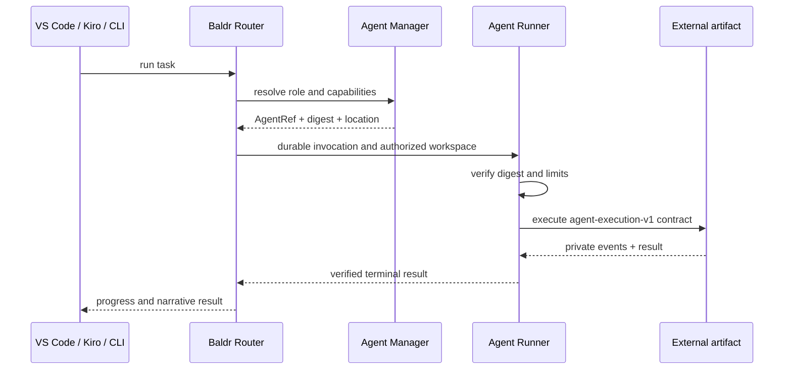

# External agents need boundaries, not a larger orchestrator

Language models make it possible to create agents very quickly. The difficult
problem comes next: identifying them, building them reproducibly, granting only
the permissions they need, coordinating them from different surfaces, and
updating or reverting a version without losing traceability. Baldr's evolution
shows why an orchestrator should not take ownership of agent code. Instead, it
should provide stable contracts to discover, resolve, and execute agents.

**July 18, 2026**

---

**Author:** Baldr Team

This article explains the design decisions behind Baldr's external-agent
platform. It does not replace the [External Agent Runtime](external-agent-runtime.md)
or [Builder Protocol](builder-protocol.md) specifications. It explains why
those boundaries exist and what we learned while building a real vertical in
Python and TypeScript.

## Contents

- [The problem starts after the first demo](#the-problem-starts-after-the-first-demo)
- [Why agents should not live inside Baldr](#why-agents-should-not-live-inside-baldr)
- [The architecture emerged from a real use case](#the-architecture-emerged-from-a-real-use-case)
- [A semantic model for talking about agents](#a-semantic-model-for-talking-about-agents)
- [Builder Protocol as a polyglot boundary](#builder-protocol-as-a-polyglot-boundary)
- [Example: an end-to-end TypeScript agent](#example-an-end-to-end-typescript-agent)
- [Coordination is not execution](#coordination-is-not-execution)
- [Immutable identity instead of ambiguous names](#immutable-identity-instead-of-ambiguous-names)
- [Permissions are part of the agent's type](#permissions-are-part-of-the-agents-type)
- [Two distinct stages of work](#two-distinct-stages-of-work)
- [What Baldr should own and what should remain outside](#what-baldr-should-own-and-what-should-remain-outside)
- [Costs and limits of this architecture](#costs-and-limits-of-this-architecture)
- [The next step](#the-next-step)
- [Conclusion](#conclusion)

---

Agents often begin as a function that receives an instruction, calls a model,
and returns a response. That is enough to explore an idea. It also hides almost
every decision that appears when the agent starts working on real repositories.

Which version ran? Who published it? Can it read, or can it write too? Is the
artifact that runs the same one that was reviewed? What happens if the process
is interrupted after modifying a file? How can VS Code, Kiro, or a CLI use the
same agent? How do you return to the previous version?

These questions are not solved by adding instructions to a prompt. They
require identity, contracts, effect boundaries, persistence, and a release cycle.

## The problem starts after the first demo

A prototype can point directly to a Python file, TypeScript script, or local
configuration. Location acts as identity, while the developer's environment
implicitly supplies everything that is missing. The agent finds dependencies
because the checkout is present, inherits terminal credentials, and writes
because its process can access the same workspace as the person.

That convenience becomes ambiguity when the agent is shared:

- a local path does not represent a version;
- the same name can resolve to different content;
- a build can accidentally depend on `node_modules`, a virtual environment, or
  monorepo files;
- effective permission depends on the process that started the agent;
- an update can silently replace behavior currently in use;
- an interface can show an agent as available even when its artifact no longer exists.

The initial temptation is to incorporate everything into the orchestrator:
copy agents into the main repository, add their prompts to central
configuration, and grant them the same tools. This reduces friction for a few
days, but every new agent then expands the core, the release cycle, and the
trust surface of the entire product.

> **Core idea:** creating an agent can be easy; operating it as an
> identifiable, replaceable, and bounded unit is a platform problem.

## Why agents should not live inside Baldr

Baldr coordinates work. The teams that create agents own their code, tests,
language, and publishing schedule. Mixing those responsibilities would create
an organizational monolith before it created a purely technical one.

If agents lived inside Baldr, Router would need to understand:

- every project's structure;
- every language's dependencies and tools;
- each team's private prompts and rules;
- how to build and test every artifact;
- every agent's update cadence;
- secrets or resources specific to products Baldr should not own.

The alternative is for Baldr to know only what coordination requires: an exact
identity, declared capabilities, effect mode, stable location, manifest digest,
and execution protocol.

```text
owning team                           Baldr infrastructure

code + tests
      |
      v
language SDK
      |
      v
Agent Builder + driver  ------->  artifact + manifests
                                         |
                                         v
                                   Agent Manager
                                         |
                                  AgentRef + digest
                                         |
                                         v
                                Router -> Runner
                                         |
                                         v
                                authorized workspace
```

This separation lets an agent be developed in another repository without
becoming a plugin loaded into Router's process. Baldr retains control of
coordination and policy; the team retains ownership of behavior.

## The architecture emerged from a real use case

The separation looks simple once it is drawn. It did not come from defining
every interface in advance. It emerged while trying to run the same agent from
an external repository in two languages.

The first functional slice revealed responsibilities that were initially mixed:

1. The SDK had to expose the API imported by the agent without incorporating
   the publishing toolchain.
2. Agent Builder had to understand the project and release lifecycle without
   implementing every language internally.
3. Each driver had to transform sources into a reproducible artifact through a
   common contract.
4. Agent Manager had to store and resolve identities, not execute code.
5. Runner had to execute the artifact outside Router and apply data and effect limits.
6. Router had to coordinate durable phases and select exact participants.

The TypeScript pilot agent was especially useful. While the driver ran only
from the monorepo, it appeared independent. Installing it globally from a
tarball exposed a hidden dependency: the driver digest included absolute paths
and changed with the installation directory. The solution was not to document
a recommended path, but to redefine identity over logical names and content.

The defect was small, but it demonstrated a general rule: a boundary is not
real until it works without the checkout that created it.

## A semantic model for talking about agents

Before the external platform, words such as “agent,” “model,” “role,” and
“provider” could overlap. Coordinating published agents required a more precise vocabulary.

Baldr's model distinguishes:

- **role:** responsibility within a phase, such as planning, execution, or review;
- **AgentRef:** versioned participant identity;
- **manifest digest:** identity of the declared content;
- **artifact:** self-contained program executed by Runner;
- **capability:** action the agent claims it can perform;
- **effect mode:** operational boundary, such as `read-only` or `workspace-write`;
- **driver:** build implementation for one language;
- **release:** immutable combination of definition, artifact, and manifests;
- **team resolution:** durable decision that assigns exact identities to workflow roles.

A typical reference looks like this:

```text
local://personal/repository-report-typescript-writer@1.0.0
```

The name helps a person, but is not enough to execute. Resolution also pins the
manifest digest. The workflow preserves both pieces and does not reinterpret
“the latest version” halfway through a session.

```text
exact AgentRef + exact digest + capabilities + effects
                         |
                         v
               durable participant
```

This semantic model reduces the open decisions left to facades. VS Code and
Kiro do not need to understand how a TypeScript agent was built. They only need
to present compatible options and send Baldr the selected identity.

## Builder Protocol as a polyglot boundary

A polyglot SDK does not by itself solve polyglot builds. Python can produce a
`.pyz`; TypeScript can produce a `.cjs`; Rust could produce a binary. Their
toolchains, inventories, and diagnostics differ.

Implementing every decision inside Agent Builder would recreate the coupling
we wanted to avoid. Builder Protocol introduces a neutral boundary between the
development lifecycle and the language-specific tool.

```text
baldr-agent test/build/publish
              |
              v
       Builder Protocol v1
              |
       identity-based selection
              |
              +----> Python driver
              +----> TypeScript driver
              +----> future Rust driver
```

The driver announces an identity containing id, version, and digest. Agent
Builder discovers it from explicit registration or through a bounded executable
in `PATH`. They then exchange versioned JSONL requests and responses.

The protocol does not try to standardize compilers. It standardizes what
Builder must verify:

- which operation was requested;
- which source inventory it used;
- which driver version performed it;
- which artifact it produced;
- the artifact's digest;
- which metadata accompanies the release;
- whether a repetition represents the same work.

JSON is a transport format, not the complete model. Semantics live in the
versioned contract, validation, and invariants around the message.

## Example: an end-to-end TypeScript agent

The flow starts in the team's repository, not in Baldr:

```bash
baldr-agent init ./repository-report \
  --name repository-report \
  --owner personal \
  --namespace personal \
  --language typescript

cd repository-report
baldr-agent test
baldr-agent build
baldr-agent publish
baldr-agent doctor
```

The project declares its language, entrypoint, driver, and roles in
`baldr-agent.toml`:

```toml
schema_version = 2
name = "repository-report-typescript"
owner = "personal"
namespace = "personal"
version = "1.0.0"
language = "typescript"
entrypoint = "src/agent.ts"
driver = "baldr.typescript"

[[roles]]
name = "writer"
capabilities = ["workspace.read", "workspace.write", "role.implementer"]
effect_mode = "workspace-write"
```

The code imports only the authoring SDK. The following fragment abbreviates
`final_report`; a real agent completes the narrative and evidence fields
defined by the role contract:

```ts
import { Agent } from "@baldr/agent-sdk";

const agent = new Agent({
  ref: process.env.BALDR_AGENT_REF!,
  owner: "personal",
  capabilities: ["workspace.read", "workspace.write", "role.implementer"],
});

agent.invoke(async (request, context) => {
  context.emit("analyzing", "Reviewing the repository");
  // Behavior belongs to the agent repository.
  return {
    ok: true,
    final_report: {
      status: "implemented",
      summary: "The report was generated",
    },
  };
});

process.exitCode = await agent.serveStdio();
```

During `build`, the TypeScript driver produces a self-contained `.cjs`. Two
builds from the same sources must produce the same bytes. During `publish`,
Agent Builder installs the artifact at a stable location, generates planner,
writer, and reviewer manifests, and publishes those identities to the local
catalog or Agent Manager.

The agent's code is never copied into Router. What crosses the boundary is an
identifiable release.

## Coordination is not execution

Separating Router and Runner prevents the control plane from becoming the
place where third-party code runs.

Router decides:

- which workflow is active;
- which role must run;
- which exact identity fills that role;
- which capabilities the phase allows;
- what to do on retries, cancellation, or uncertain results;
- which durable progress can be shown to the person.

Runner decides:

- how to verify the artifact immediately before execution;
- which directory the process receives;
- which minimal environment it can inherit;
- how to limit time and input/output size;
- how to persist private state and events;
- how to terminate the process group;
- when a write interruption must be marked `unknown`.



This separation also leaves room for the data plane to evolve. A future Runner
could use containers or remote jobs without changing how workflows pin
identities and results.

## Immutable identity instead of ambiguous names

A published version cannot accept different content. If code, roles,
capabilities, or manifests change, the version must change.

Immutability provides three properties:

1. **Safe repetition.** Publishing the exact same release again is idempotent.
2. **Auditability.** A durable session can prove which manifest and artifact it used.
3. **Rollback.** Returning to `1.0.0` reactivates a known identity instead of
   approximately rebuilding a previous state.

```text
1.0.0 + digest A  -> valid
1.0.0 + digest A  -> idempotent repetition
1.0.0 + digest B  -> rejected; requires a new version
1.1.0 + digest B  -> valid
```

The digest does not replace the version. The version communicates intent and
evolution to people; the digest proves content to machines. Baldr needs both.

## Permissions are part of the agent's type

An agent should not receive permissions merely because the invoking
application can write. The manifest declares capabilities, and the phase
declares which effects it accepts. Effective permission is their intersection.

For planning and review, Runner creates a reduced disposable copy without Git
metadata, generated dependencies, symlinks, or special entries. The agent can
observe, but does not receive the original path.

For implementation, Baldr provides the exact workspace only when:

- the role requires writing;
- the manifest declares `workspace.write`;
- effect mode is `workspace-write`;
- the surface already trusted the workspace;
- policy preserves a single writer for the phase.

This avoids two equally problematic extremes: always blocking writes that are
already authorized, or trusting any agent merely because it was selected from
a local interface.

It also changes failure semantics. Interrupting a read allows a normal retry.
Interrupting a write can leave partial effects, so the result becomes `unknown`
and requires durable reconciliation.

## Two distinct stages of work

The platform exposes two cycles that should not be mixed.

### Design and publish the agent

In this stage, the team explores behavior, changes code, improves tests, and
discovers which capabilities it needs. The SDK provides vocabulary; Agent
Builder and the driver provide validation and reproducibility.

The process is deliberately iterative:

```text
idea -> implementation -> test -> build -> inspection -> new version
```

Baldr should not try to decide the agent's internal architecture. That design
belongs to the team that maintains it.

### Resolve and operate the agent

Once published, the relationship changes. The workflow does not receive “the
newest agent” as an open suggestion. It receives a compatible identity,
verifies its state, and pins it for the session.

```text
discovery -> resolution -> execution -> evidence -> update/rollback
```

Creativity matters less than predictability here. Decisions must be
deterministic, explainable, and recoverable after a restart.

Separating these stages lets development remain flexible without making
operations ambiguous.

## What Baldr should own and what should remain outside

Baldr should own:

- contracts and identities;
- team discovery and resolution;
- capability and effect policies;
- durable workflows;
- isolated execution through Runner;
- evidence, diagnostics, and recovery;
- consistent surfaces for VS Code, Kiro, CLI, and MCP.

Baldr should not own:

- the source code of every agent;
- a mandatory programming language;
- every product's private prompts;
- every toolchain rebuilt internally;
- automatic access to all user secrets;
- the owning team's versioning system;
- a silent decision that replaces an active session with a new version.

The distinction is simple: Baldr owns coordination; each team owns behavior.

## Costs and limits of this architecture

Explicit boundaries are not free. The platform introduces more concepts,
packages, and contracts than a direct script call.

The costs are concrete:

- SDK, Builder, drivers, and Runner must evolve compatibly;
- contracts need conformance suites;
- a self-contained artifact can be larger;
- publishing requires semantic discipline;
- diagnostics must explain failures distributed across control and data planes;
- local guarantees do not automatically equal strong container or VM isolation;
- remote execution will require more advanced authentication, tenancy, and secret handling.

Not every agent needs this platform. A disposable personal script can remain a
script. The investment is justified when an agent is shared, changes over
time, operates on relevant data, or must run from more than one surface.

The signal for adopting these boundaries is not prompt complexity. It is the
need to answer precisely who executed what, with which permissions, and with
which result.

## The next step

The architecture already demonstrates the Python and TypeScript vertical. The
next improvement should not be more orchestration types, but a shorter path
from a clean installation to the first useful execution.

A concrete goal is to let a person:

1. install Agent Builder and a published driver;
2. create an agent with one command;
3. test and build it without knowing the Baldr checkout;
4. execute it locally before publishing;
5. publish an immutable version;
6. select it by a human name in VS Code or Kiro;
7. observe the result and roll back;
8. repeat the full flow through a documented smoke test.

The driver conformance suite will be important at this stage. A new driver
should prove discovery, stable digest, valid protocol, reproducible build,
cancellation, absence of local paths, and Runner compatibility before it is
announced as available.

## Conclusion

LLMs accelerate the creation of agent behavior, but do not eliminate the need
to design the surrounding system. The easier it becomes to generate agents,
the more important it becomes to operate them without indefinitely expanding
the orchestrator's core.

Baldr treats external agents as releases owned by other teams. SDK provides the
authoring vocabulary. Agent Builder and its drivers turn sources into
reproducible artifacts. Agent Manager resolves immutable identities. Runner
executes behind an explicit boundary. Router coordinates durable work from the
existing surfaces.

The result is not merely support for more languages. It is a division of
responsibilities that lets the ecosystem grow without requiring Baldr to
absorb every agent into itself.
